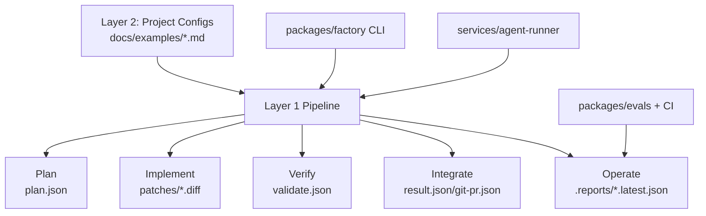

# Agent Factory

[](https://github.com/mrburke86/agent-factory-workspace/actions/workflows/ci.yml)
[](https://opensource.org/licenses/MIT)
[](https://nodejs.org/)
[](https://pnpm.io/)

Agent Factory is a two-layer framework for building, validating, and operating
autonomous coding agents with deterministic CI behavior.

## Table of Contents

- [Overview](#overview)
- [Quick Start](#quick-start)
- [Architecture](#architecture)
- [Usage Guide](#usage-guide)
- [Directory Structure](#directory-structure)
- [Configuration Reference](#configuration-reference)
- [Sprint Loop Guide](#sprint-loop-guide)
- [Roadmap](#roadmap)
- [Contributing](#contributing)
- [License](#license)

## Overview

Agent Factory separates reusable orchestration logic from project-specific
configuration. The core system (Layer 1) defines a deterministic pipeline:
Plan, Implement, Verify, Integrate, and Operate. Project teams then add Layer 2
configuration modules that parameterize those same stages for a particular
stack.

The result is a repeatable agent workflow that can be adapted across domains
without rewriting the platform core. Contracts, manifests, and eval suites keep
runtime behavior observable and stable under CI constraints.



## Quick Start

1. Clone and enter the repository.
2. Install dependencies with a frozen lockfile.
3. Build all workspace packages.
4. Run platform health checks.
5. List registered agents.
6. Run a sample smoke agent.

```bash
git clone git@github.com:mrburke86/agent-factory-workspace.git
cd agent-factory-workspace
pnpm install --frozen-lockfile
pnpm -r build
pnpm factory:health
pnpm af agent:list
pnpm af agent:run retrieval-smoke --input '{"query":"test","topK":3}'
```

## Architecture

The canonical architecture contract lives in `AGENTS.md`. It defines a
two-layer model:

- Layer 1 is the model-agnostic pipeline and runtime surface:
  `services/agents/`, `services/agent-runtime/`, `services/agent-runner/`,
  `packages/factory/`, `packages/contracts/`, and `packages/evals/`.
- Layer 2 is documentation-first, project-specific configuration in
  `docs/examples/` that describes how each Layer 1 stage should be parameterized
  for a target stack.

Layer 2 does not replace the pipeline. It supplies project metadata, stage
override templates, constraints, and acceptance criteria that the sprint loop
operator feeds into the prompt compiler and then into stage execution.

Primary references:

- `AGENTS.md`
- `SPRINT_PLAN.md`
- `docs/templates/layer2-config-schema.md`
- `docs/templates/layer2-example-template.md`
- `docs/examples/nextjs-micro-saas.md`
- `docs/examples/python-cli-tool.md`

## Usage Guide

Agent Factory is operated through deterministic `pnpm af` and health commands.
Use workspace root unless a command explicitly targets a sub-package.

```bash
# List all available agents
pnpm af agent:list

# Run a specific agent with JSON input
pnpm af agent:run retrieval-smoke --input '{"query":"refund policy","topK":5}'

# Run with input schema validation
pnpm af agent:run retrieval-smoke --input '{"query":"test","topK":3}' --validate-input

# Validate one agent manifest/schema wiring
pnpm af agent:validate retrieval-smoke

# Validate all agents
pnpm af agent:validate:all

# Run full platform health gates
pnpm factory:health
```

Additional deterministic workspace scripts are defined in `package.json`.

## Directory Structure

Annotated repository map (generated from current workspace layout):

```text
.
├── .github/
│   └── workflows/
│       ├── ci.yml
│       └── factory-health.yml
├── docs/
│   ├── archive/
│   ├── examples/
│   │   ├── nextjs-micro-saas.md
│   │   └── python-cli-tool.md
│   └── templates/
│       ├── layer2-config-schema.md
│       └── layer2-example-template.md
├── packages/
│   ├── contracts/
│   │   ├── src/
│   │   └── scripts/
│   ├── evals/
│   │   ├── src/
│   │   ├── scripts/
│   │   └── .reports/
│   └── factory/
│       └── src/
├── services/
│   ├── agent-runner/
│   │   └── src/
│   ├── agent-runtime/
│   │   └── src/
│   └── agents/
│       ├── _shared/
│       ├── esm-smoke/
│       ├── git-pr/
│       ├── plan/
│       ├── repo-patch/
│       ├── repo-read/
│       ├── retrieval-smoke/
│       └── validate/
├── AGENTS.md
├── AGENTS_V2.md
├── SPRINT_PLAN.md
├── package.json
├── pnpm-lock.yaml
├── pnpm-workspace.yaml
└── verify-sprint.ps1
```

Key path notes:

- `packages/factory` contains the CLI implementation behind `pnpm af`.
- `services/agent-runner` performs manifest-driven loading and execution.
- `services/agent-runtime` contains shared runtime helpers/contracts.
- `packages/evals/.reports/` holds latest deterministic report artifacts.
- `services/agents/repo-patch` orchestrates scoped repository patch tasks.

## Configuration Reference

### Agent Manifest (`agent.json`)

Every agent directory under `services/agents/<id>/` must include `agent.json`
with these fields:

- `id`: stable agent identifier.
- `name`: human-readable name.
- `version`: manifest/package version.
- `entry`: module entry path loaded by the runner.
- `inputSchema`: JSON schema for accepted input.
- `outputSchema`: JSON schema for `AgentResult`.
- `capabilities` (optional): string list of declared capabilities.

Agent contract requirements:

- Export `run(input)` and return `AgentResult`.
- Use ISO date-time strings for timestamp fields.
- Import runtime helpers from `@acme/agent-runtime`.

### Layer 2 Configuration

Layer 2 configs are markdown files in `docs/examples/` with a
`## Layer 2 Configuration` section. Required shape:

- `projectName`: project identifier.
- `techStack`: stack object (`language`, `framework`, optional integrations).
- `stages`: per-stage overrides (`plan`, `implement`, `verify`, `integrate`,
  `operate`) including prompt template, constraints, expected outputs, and
  acceptance criteria.

Schema details: `docs/templates/layer2-config-schema.md`.

## Sprint Loop Guide

This repository is built through a closed feedback loop across four actors:
Claude Project compiles the next prompt, Codex executes one milestone, local
PowerShell verifies acceptance commands, and GitHub Actions is the final CI
gate. The operator pastes outputs between systems and advances only when gates
pass. Ground truth priority is strict: CI results override local results, and
local results override Codex claims. Each sprint targets exactly one milestone
and ends with a single commit when possible. `SPRINT_PLAN.md` is the source of
truth for tasks, acceptance criteria, and sprint log status. A dedicated
workflow document (`WORKFLOW_V2.md`) is planned but is not present in this
repository yet.

## Roadmap

- Expand Phase 3 agents for code generation, test authoring, and security scans.
- Add orchestration-focused agents for multi-stage planning and integration.
- Harden CI with broader deterministic eval suites and richer report gating.
- Publish more Layer 2 examples across web, backend, and data workflows.

## Contributing

1. Open an issue or draft proposal for non-trivial changes.
2. Keep diffs small and milestone-scoped.
3. Follow project standards: TypeScript strict mode, ESM/NodeNext compatibility,
   deterministic command behavior, and manifest contract invariants.
4. Run required checks before push:
   `pnpm install --frozen-lockfile`, `pnpm -r build`, `pnpm factory:health`.
5. Use clear conventional commit style (for example: `docs(scope): summary`).
6. Update `SPRINT_PLAN.md` when sprint state changes.

## License

This project is released under the MIT License.
